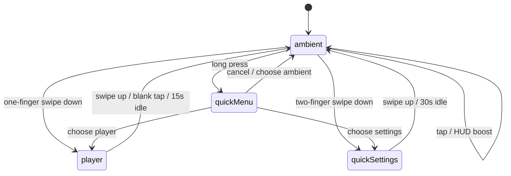

# Interaction and State Model v1

## Summary

Tikpal uses a small finite state machine. Only one primary overlay should be active at a time. This avoids stacked overlays, accidental setting changes, and app-like navigation complexity.

## App Modes

```ts
type AppMode = "ambient" | "player" | "quickSettings" | "quickMenu";
```

| Mode | Entry | Exit |
| --- | --- | --- |
| `ambient` | Default startup and timeout state. | One-finger swipe down, two-finger swipe down, long press, tap, optional horizontal swipe. |
| `player` | One-finger swipe down from `ambient`; quick menu item. | Swipe up, blank tap, 15s inactivity. |
| `quickSettings` | Two-finger swipe down from `ambient`; weak gear; quick menu item. | Swipe up, 30s inactivity, confirmed action completion. |
| `quickMenu` | Long press on `ambient`. | Select item, cancel, blank tap. |

## Gesture Contract

| Gesture | Target | Behavior |
| --- | --- | --- |
| One-finger swipe down | Ambient | Open player overlay. |
| Two-finger swipe down | Ambient | Open quick settings overlay. |
| Swipe up | Player or quick settings | Return to ambient, including swipes that start inside the overlay panel. |
| Tap | Ambient | Strengthen playback HUD for 3 seconds. |
| Long press | Ambient | Open quick menu. |
| Horizontal swipe | Ambient | Optional v2 ambience switch. |

## Gesture Thresholds

| Gesture | Recommended Threshold |
| --- | --- |
| One-finger swipe down | 80-120px vertical travel. |
| Two-finger swipe down | 120-160px vertical travel. |
| Long press | 800-1000ms. |
| Tap HUD boost | 3000ms visible duration. |
| Player inactivity timeout | 15s. |
| Quick settings inactivity timeout | 30s. |
| Dangerous confirmation timeout | No auto-close, or extend to 60s. |

## Two-Finger Mistake Prevention

The two-finger settings gesture must have process feedback:

- At about 40px travel, show a subtle top hint: continue down for settings.
- At about 120px travel, commit to quick settings.
- If released before the threshold, cancel and return to ambient.

This keeps system settings discoverable without making accidental two-finger contact dangerous.

## Fallback Entries

System settings must not rely only on a hidden two-finger gesture. The product must support at least one additional entry, preferably more:

- Weak gear icon in the top-right corner.
- Long-press quick menu.
- Future remote Setup key.
- Future mobile / Web UI entry.

## State Transitions



## Interaction Details

### Ambient

- Tap does not open controls; it only strengthens the HUD temporarily.
- Horizontal swipe is reserved for ambience mode switching after MVP.
- The weak top-right settings entry should be visible enough to discover but not visually compete with the flame scene.

### Player

- Blank tap returns to ambient because player is a temporary overlay.
- Swipe up returns to ambient even when the gesture starts inside the protected player panel.
- Button-sized taps inside the protected player panel must remain local control actions, not blank-tap returns.
- Transport controls must never be smaller than 72 x 72px.
- Play / pause should be the dominant control, 96-112px.
- Queue, source, audio status, and volume can expand panels from within player.

### Quick Settings

- Cards are overview-first.
- Swipe up returns to ambient even when the gesture starts inside the protected settings panel.
- Button-sized taps inside the protected settings panel must remain local settings actions, not blank-tap returns.
- Dangerous actions require a confirmation state inside the card or a modal.
- Reboot, shutdown, database rebuild, audio output switch, network reset, and reset defaults are dangerous.

### Quick Menu

- Quick menu is a fallback, not a second navigation system.
- It should never expose deep settings directly.
- It should close cleanly on cancel or after choosing an item.

## Input Compatibility

MVP is touch-first. The state model should still reserve clean mappings for:

- Remote control: directional navigation, select, back, setup.
- Rotary control: volume, selection, press to confirm.
- Browser/dev input: mouse or touchpad simulation for local development.

Current desktop validation mappings:

- Wheel / trackpad down from ambient opens `player`.
- Shift + wheel / trackpad down from ambient opens `quickSettings`.
- Wheel / trackpad up from an overlay returns to `ambient`.
- Clicks inside protected overlay panels do not count as blank-tap return.
- Drag / touch-swipe up inside protected player or settings panels returns to `ambient`.

## Non-Goals

- No multi-window navigation.
- No stacked player and settings overlays.
- No full moOde admin surface in the kiosk UI.
- No dangerous operation on first tap.
