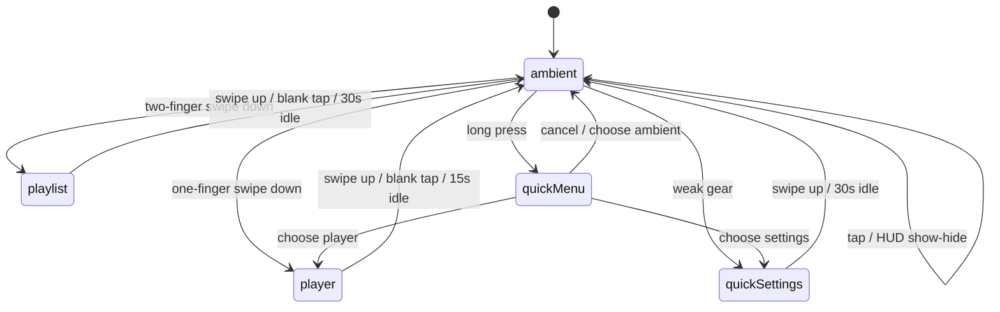

# Interaction and State Model v1

## Summary

Tikpal uses a small finite state machine. Only one primary overlay should be active at a time. This avoids stacked overlays, accidental setting changes, and app-like navigation complexity.

## App Modes

```ts
type AppMode = "ambient" | "player" | "playlist" | "quickSettings" | "quickMenu";
```

| Mode | Entry | Exit |
| --- | --- | --- |
| `ambient` | Default startup and timeout state. | One-finger swipe down, two-finger swipe down, long press, tap, optional horizontal swipe. |
| `player` | One-finger swipe down from `ambient`; quick menu item. | Swipe up, blank tap, 15s inactivity. |
| `playlist` | Two-finger swipe down from `ambient`; Player playlist entry. | Swipe up, blank tap, 30s inactivity. |
| `quickSettings` | Weak gear; quick menu item. | Swipe up, 30s inactivity, confirmed action completion. |
| `quickMenu` | Long press on `ambient`. | Select item, cancel, blank tap. |

## Gesture Contract

| Gesture | Target | Behavior |
| --- | --- | --- |
| One-finger swipe down | Ambient | Open player overlay. |
| Two-finger swipe down | Ambient | Open playlist / Scene Library overlay. |
| Swipe up | Player, playlist, or quick settings | Return to ambient, including swipes that start inside the overlay panel. |
| Tap | Ambient | In Focus/Calm/Sleep, show the HUD and open the lightweight source picker; in Hi-Fi, toggle the HUD. The HUD and picker auto-hide after 5 seconds without input. |
| Long press | Ambient | Open quick menu. |
| Vertical drag in left ambient zone | Ambient | Live display brightness adjustment through DDC/CI when available. The overlay follows the hand immediately, but backend writes are coalesced to the final resting value. |
| Vertical drag in right ambient zone | Ambient | Live volume adjustment against moOde volume state. The overlay follows the hand immediately, but backend writes are coalesced to the final resting value. |
| Non-Hi-Fi Ambient center controls | Ambient HUD visible | Previous scene, Focus/Calm/Sleep label plus intent, lightweight source picker, Scene Sound mute/unmute, and next scene. The strip width should follow its content rather than a fixed playback-control width. |
| Hi-Fi Ambient center controls | Ambient HUD visible | Play mode, lightweight source picker, previous track, play/pause, next track, favorite, playlist, and lyrics. |
| Arrow keys | Ambient HUD visible | In Focus/Calm/Sleep, up/down/left/right change scene and Space/Enter toggles Scene Sound. In Hi-Fi, scene arrows switch EQ presets and track arrows keep playback behavior. |
| Volume range slider | Player | Update the same global volume state used by Ambient and scene video audio. |

## Gesture Thresholds

| Gesture | Recommended Threshold |
| --- | --- |
| One-finger swipe down | 80-120px vertical travel. |
| Two-finger swipe down | 120-160px vertical travel. |
| Long press | 800-1000ms. |
| Ambient HUD default dwell | 5000ms from startup before auto-hide. The startup room-mode chooser may auto-dismiss to the current persisted mode, but it must not re-send `set_mode` or replay room preset side effects unless the user taps a mode. |
| Tap-shown HUD dwell | 5000ms before auto-hide. |
| Player inactivity timeout | 15s. |
| Quick settings inactivity timeout | 30s. |
| Dangerous confirmation timeout | No auto-close, or extend to 60s. |

## Two-Finger Mistake Prevention

The two-finger Scene Library gesture must have process feedback:

- At about 40px travel, show a subtle top hint: continue down for playlist.
- At about 130px travel, commit to playlist.
- If released before the threshold, cancel and return to ambient.

This keeps ritual and playlist management discoverable without letting accidental two-finger contact feel like a mode jump.

## Fallback Entries

System settings must not rely only on a hidden two-finger gesture. The product must support at least one additional entry, preferably more:

- Weak gear icon in the top-right corner.
- Long-press quick menu.
- Future remote Setup key.
- Future mobile / Web UI entry.

## State Transitions



## Interaction Details

### Ambient

- In Focus/Calm/Sleep, a tap shows the HUD and opens a lightweight source picker with six music/input choices: `Library`, `Radio`, `Spotify`, `AirPlay`, `Bluetooth`, and `DLNA`.
- The source picker floats centered above the temporary center strip, closes after a successful selection, outside click, Escape, or 5 seconds without interaction, and must show active, pending, and unavailable/error state.
- Source picker labels map internal source ids to user language: `mpd` is `Library`, and `upnp` is `DLNA`. It does not expose `scene` or `audio` as selectable music sources.
- Selecting `Spotify`, `AirPlay`, `Bluetooth`, or `DLNA` enters the same external handoff state in Player and Hi-Fi: hide the normal source choices, show a "Waiting for connection" card with the advertised receiver name when available, keep polling the shared source state, and close only when the source is ready or the handoff times out and rolls back to the previous playable source. In Focus/Calm/Sleep, the picker closes immediately after the handoff starts and a lower-left source pill carries the waiting or connected state so the scene video stays immersive.
- Switching from one external intake to another should feel target-first: once the requested intake is armed or connected, the UI can show that target while the previous external receiver is cleaned up in the background. Switching back to Library or Radio is stricter: the backend must wait for MPD-backed playback/source truth so stale external waiting state cannot keep the surface stuck on Spotify, AirPlay, Bluetooth, or DLNA.
- Startup should show the HUD briefly, then let the flame scene return to a quieter default after 5 seconds.
- Scene controls stay inside the temporary HUD. They do not open a scene browser or playlist drawer.
- The bottom HUD is a mode switcher for Focus, Calm, Sleep, and Hi-Fi.
- Focus, Calm, and Sleep use a content-sized center strip with the mode name and intent: `Focus / Deep work & reading`, `Calm / Unwind & relax`, and `Sleep / Dim, timer, fade-out`.
- When the clock is visible, the weak Ambient caption may include daypart, scene, and weather/location context from `/api/v1/scene/context`, but it remains decorative copy and must not change room mode, source, timer, or Auto Night behavior.
- Focus, Calm, and Sleep do not show music playback buttons, favorite, playlist, queue, seek progress, or lyrics on Ambient. Lyrics remain a Hi-Fi playback affordance only.
- Hi-Fi uses the larger playback center controls: playback mode, source picker, previous/next, play/pause, favorite, playlist, and lyrics. Entering Hi-Fi restores the global remembered visible source from `audio.rememberedSource`: a saved Library track is retried with a plain Library fallback, a saved Radio station reopens by `radioStationId`, and saved Spotify/AirPlay/Bluetooth/DLNA sources reopen their waiting handoff state. The same restore applies when the app or API restarts while persisted room mode is already Hi-Fi, so a late-arriving `rememberedSource` must still be honored instead of leaving the room at `Not Playing`. During that startup restore, the first state visible to the kiosk should already reflect the recovered Library/Radio playback instead of a stale `stopped` snapshot. While Hi-Fi remains active, the backend should also recover remembered Library/Radio playback if MPD falls back to `stopped` or the wrong source; an explicit `paused` state and external-source waiting states are user intent and must not be auto-resumed. Hi-Fi source picker selections should release their pending UI as soon as backend state confirms the selected source, so switching from AirPlay to Bluetooth or back to Library never leaves the source button disabled. Library memory follows the actual local song after manual selection, playlist play, next, and previous; current-track checks may match by queue file path or by the remembered track's title / artist / duration so an internal queue id does not trigger a duplicate Library restore. Radio memory follows the final station that actually plays, even after the user returns to Library. Returning to either music source from Focus/Calm/Sleep should resume that source's last position without showing a blocking overlay.
- Hi-Fi defaults to centered now-playing artwork and metadata. When the lyrics toggle is on and `lyrics.status === "ready"` with at least one non-empty line, the main visual may switch to a shared cover-plus-lyrics wall; Bluetooth and AirPlay both use this same input-lyrics wall instead of source-specific lyric layouts. The compact rolling lyrics ticker is reserved for Focus/Calm/Sleep and must not appear under the Hi-Fi wall. The wall may include a decorative CSS-only mini EQ, progress line, elapsed/duration readout, and capability-gated playback controls. When lyrics are unavailable, empty, or explicitly hidden, it must return to centered now-playing and hide lyrics surfaces. Old kiosk hidden-state storage is auto-restored once so a stale `lyricsVisible=false` value does not suppress newly ready lyrics forever. The centered fallback must still show a non-interactive playing-state motion cue that is visible at low volume and does not depend on audio amplitude.
- Synced Hi-Fi lyrics should project the active line from the shared `playback.elapsedSeconds` clock between backend snapshot refreshes, then re-anchor on the next playback update. If the backend has ready lyrics but no reliable active line, the wall should stay visible and rotate a static active line locally. Both paths must derive from the same `lyrics` object so Ambient, Player, and portable remote state do not invent separate track truth.
- AirPlay playback must refresh title, artist, album, cover art, elapsed time, and lyrics from the same backend metadata snapshot, but only after the AirPlay source is truly `connected`; `armed` means waiting and must not drive the lyrics wall. When the AirPlay track changes, all surfaces should prefer a temporary no-cover, recognizing, or `not_found` state over showing stale cover art, old lyrics, or same-title lyrics from a different artist with the new title.
- Ambient must not show queue or playlist content; queue preview stays in the Player overlay.
- Choosing any non-scene source from Ambient immediately switches through `/api/v1/audio/source`, keeps the current scene video visible in Focus/Calm/Sleep, clears persisted `sceneSoundEnabled` so browser scene audio stays muted, and displays only a compact source pill after the picker closes.
- The left edge band is reserved for live brightness drag and should not fall through to the generic one-finger swipe-down player gesture.
- The right edge band is reserved for live volume drag and should not fall through to the generic one-finger swipe-down player gesture.
- If DDC/CI brightness is unavailable on the target display, the left-side control zone should show unavailable feedback instead of behaving like a normal ambient gesture lane.
- Horizontal swipe is reserved for ambience mode switching after MVP.
- The weak top-right settings entry should be visible enough to discover but not visually compete with the flame scene.

### Player

- Blank tap returns to ambient because player is a temporary overlay.
- Swipe up returns to ambient even when the gesture starts inside the protected player panel.
- Button-sized taps inside the protected player panel must remain local control actions, not blank-tap returns.
- Transport controls must never be smaller than 72 x 72px.
- Play / pause should be the dominant control, 96-112px.
- Queue, source, audio status, and volume can expand panels from within player.
- Player source tabs use the same external handoff rule as Ambient for Spotify Connect, AirPlay, Bluetooth, and DLNA. A pending handoff replaces the source tabs with the waiting card so the user does not see a source as selected on one surface and merely armed on another.
- While a Radio source switch, next, or previous action is pending, Player and Hi-Fi should accept the backend's primed active-station state as display truth for station label and artwork. The station cover may change before MPD has fully verified playback; if the stream later fails and the backend auto-advances, the cover and label must move again with the recovered station.
- Player volume uses a 0-100 range slider instead of step buttons. Dragging the slider should update UI immediately, then send the final resting value through `volume_set` as the single global volume action.
- The displayed volume percent should match `system.volume.percent`, including while Scene Sound is active.
- Player, Ambient Hi-Fi, and portable remote summaries must keep now-playing title, artist, album, artwork, source label, progress, favorite state, and queue position aligned with backend playback truth. Browsing a source, arming an external intake, or previewing a playlist must not overwrite the displayed track until the backend confirms playback/source truth. Radio is the exception for station-level presentation only: a backend-primed station switch can update the Radio label and logo early, while final playback state still waits for MPD verification.
- Bluetooth and AirPlay metadata-backed lyrics use `sourceScope: "bluetooth_input"` / `"airplay_input"` and the shared playback clock, so portable remote refreshes and the kiosk Hi-Fi wall stay anchored to the same track. Ready external-input lyrics must have the same title/artist identity as playback; if LRCLIB only has a same-title different-artist result, the UI should keep the centered now-playing state.

### Quick Settings

- Cards are summary-first.
- Settings has no Home or Overview category and opens directly to Preferences.
- The only categories are Network, Preferences, and System.
- Swipe up returns to ambient even when the gesture starts inside the protected settings panel.
- Button-sized taps inside the protected settings panel must remain local settings actions, not blank-tap returns.
- Dangerous actions require a confirmation state inside the card or a modal.
- Reboot, shutdown, database rebuild, audio output switch, network reset, and reset defaults are dangerous.

### Quick Menu

- Quick menu is a fallback, not a second navigation system.
- It should never expose deep settings directly.
- It should close cleanly on cancel or after choosing an item.
- Quick Menu may expose shallow scene toggles: Scene Video, Clock, and Scene Sound.
- Turning Scene Sound on forces Scene Video on, switches playback source truth to `scene`, and unmutes only the active Ambient video layer.
- Turning Scene Sound off restores the remembered visible source: the last Library song, the last successful Radio station, or an external waiting source. If that restore fails, playback falls back to Library/MPD instead of staying stopped on `scene`.
- Turning Scene Video off while Scene Sound is active also stops Scene Sound, follows the same remembered-source resume path, and returns the video surface to a black quiet state.
- Hi-Fi mode disables Scene Video and Scene Sound controls and does not mount MP4 scenes.
- Auto Night uses the selected timezone to lower display brightness only. It must not switch modes, start Scene Sound, or interrupt Hi-Fi playback.

## Input Compatibility

MVP is touch-first. The state model should still reserve clean mappings for:

- Remote control: directional navigation, select, back, setup.
- Rotary control: volume, selection, press to confirm.
- Browser/dev input: mouse or touchpad simulation for local development.

Current desktop validation mappings:

- Wheel / trackpad up from ambient opens `player`.
- Wheel / trackpad down from ambient opens `playlist`.
- Shift + wheel from ambient also opens `playlist`.
- Wheel / trackpad up from an overlay returns to `ambient`.
- Clicks inside protected overlay panels do not count as blank-tap return.
- Drag / touch-swipe up inside protected player or settings panels returns to `ambient`.

## Non-Goals

- No multi-window navigation.
- No stacked player and settings overlays.
- No full moOde admin surface in the kiosk UI.
- No dangerous operation on first tap.
